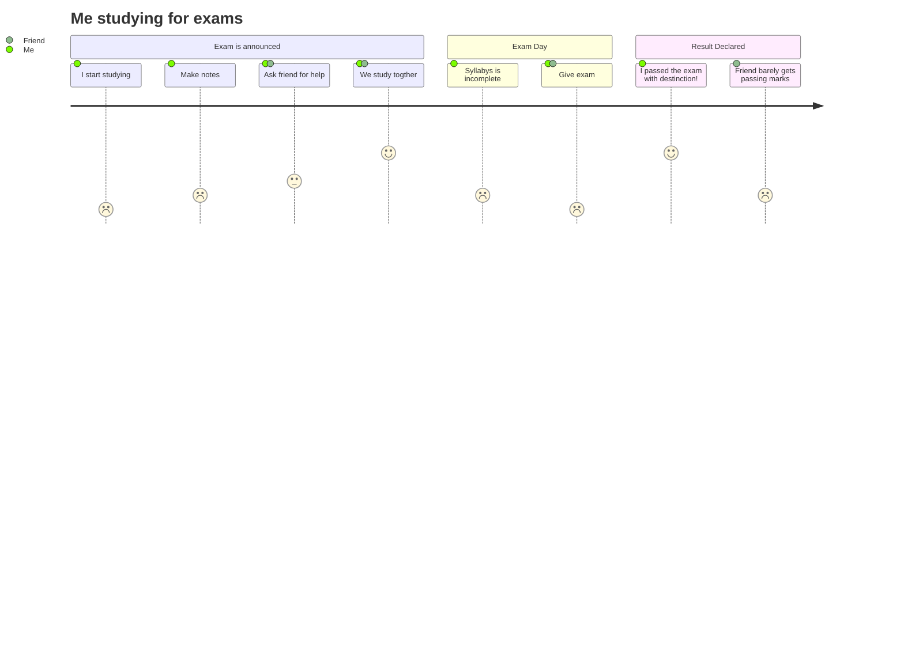

# Hi there 👋 

🌱 Never stop learning
<!-- 

 -->

## My latest project

### Hoot

This is a project inpired by Twitter, where you can create a profile and interact with users.

Repositories:

[🔗Frontend](https://github.com/mlamarques/hoot-app)
[🔗Backend](https://github.com/mlamarques/api-hoot)

	<h4>developed with: </h4>
	
	
	
	
	
	
	
	
	
	
	

<!-- https://devicon.dev/ -->
<!--  -->
---

### Some other projects

[Tenzies](https://tenzies-cyan.vercel.app/)

[Quizzical](https://quizzical-kappa.vercel.app/)

[card game](https://memorygame-6c814.web.app/)

[Where is Waldo?](https://whereswaldo-6ffb4.web.app/)

[Simple messege board (node)](https://super-simple-message-board.herokuapp.com/)

<!--
**mlamarques/mlamarques** is a ✨ _special_ ✨ repository because its `README.md` (this file) appears on your GitHub profile.

Here are some ideas to get you started:

- 🔭 I’m currently working on ...
- 🌱 I’m currently learning ...
- 👯 I’m looking to collaborate on ...
- 🤔 I’m looking for help with ...
- 💬 Ask me about ...
- 📫 How to reach me: ...
- 😄 Pronouns: ...
- ⚡ Fun fact: ...
-->
