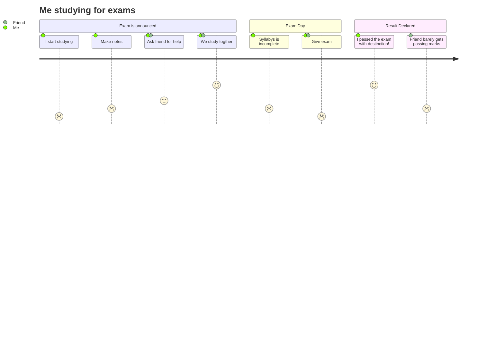

# Hi there 👋 

🔭 Never stop learning
<!-- 

 -->

## Some of my projects:

### Tenzies

  <h4>developed with: </h4>
  

---

### Quizzical

  <h4>developed with: </h4>
  

<!-- https://devicon.dev/ -->
<!--  -->
---

### Others

[card game](https://memorygame-6c814.web.app/)

[Where is Waldo?](https://whereswaldo-6ffb4.web.app/)

[Simple messege board (node)](https://super-simple-message-board.herokuapp.com/)

<!--
**mlamarques/mlamarques** is a ✨ _special_ ✨ repository because its `README.md` (this file) appears on your GitHub profile.

Here are some ideas to get you started:

- 🔭 I’m currently working on ...
- 🌱 I’m currently learning ...
- 👯 I’m looking to collaborate on ...
- 🤔 I’m looking for help with ...
- 💬 Ask me about ...
- 📫 How to reach me: ...
- 😄 Pronouns: ...
- ⚡ Fun fact: ...
-->
